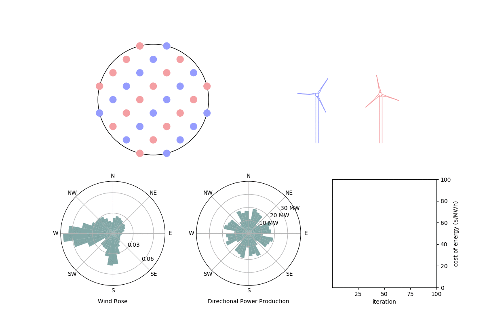

# Creating .gif Animations with imagemagick
#### PJ Stanley



imagemagick is a program that can take individual pictures (frames) that you generate and turn them into an animated .gif file. Here are some quick tips and flags when using the program that will hopefully make your experience easier.

### Installation

For a Mac you can just use brew to install: ```brew install imagemagick```
When I installed there were quite a few dependencies that I didn't have, so it took a while to install.

### Generating your frames

The first time I used imagemagick was to display turbine design and locations at each iteration of an optimization. I used pyplot to create each frame, and here are a few pointers that would have saved me a lot of time had I known them at the beginning.

- Save your frames as PNG files rather than JPEG. The individual JPEG frames are smaller, but this format compresses the image so there is some small amount of blur. This means that when you make the GIF it will be larger because there will be more pixel changes from frame to frame. 

- Don't use transparency! (in matplotlib.pyplot this means messing with alpha for your colors). This makes a lot more colors in your frame and causes the final GIF to be huge.

### Flags that I used while running imagemagick

You can run imagemagick from command line. If my frames were named my-frames01.png, my-frames02.png, etc. and I wanted to call my animation my-animation.gif, I would navigate to the folder where the frames were saved and run:

```convert my-frames* my-animation.gif```

There are however some important flags to consider.

- ```-fuzz 5% -layers Optimize``` The higher fuzz percent compresses the GIF more but is lower quality. However a low fuzz is barely noticable and compresses the GIF a lot. This is explained [here](https://stackoverflow.com/questions/8578926/how-can-i-compress-the-size-of-gif-images-with-imagemagick)

- ```-delay 8``` The means that you want each frame to appear for 8/100 seconds. Don't go below 2, imagemagick has a bug if you make this number too small and it makes your final GIF very slow. 

- ```-dispose previous``` If your background is transparent you'll probably want to delete the previous frame when the next frame appears.

-```-loop 0``` Makes your GIF loop forever.

See the full documentation [here](https://imagemagick.org/). 


